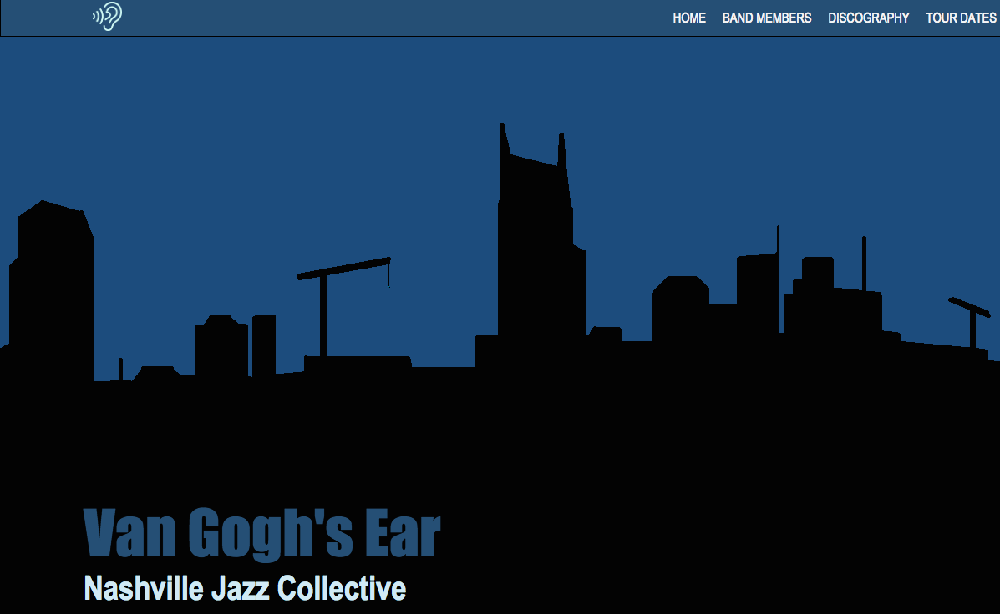
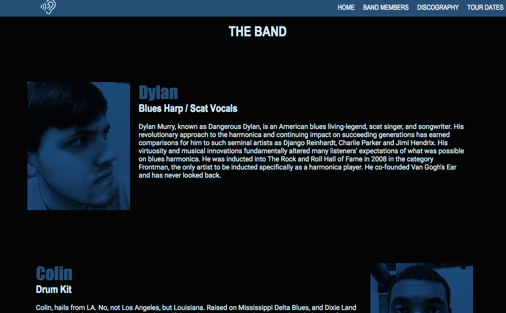
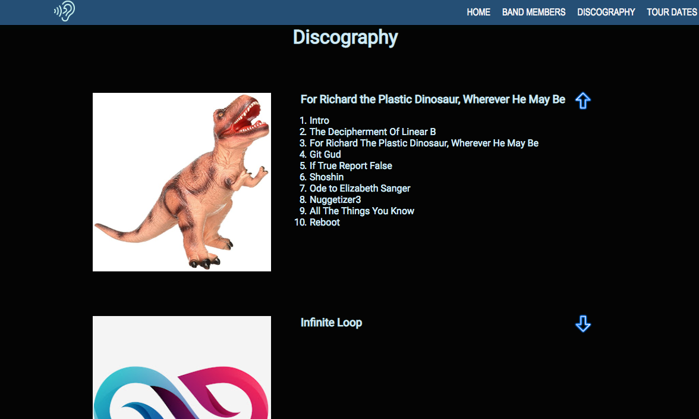
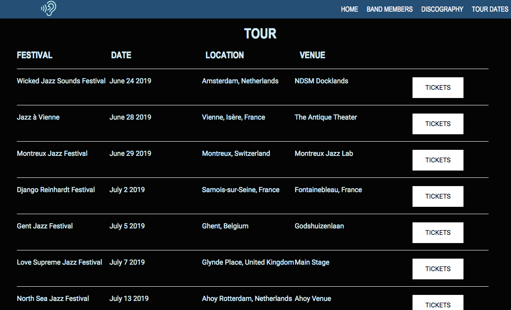

# Van Gogh's Ear
A website for Van Gogh's Ear, a fictional jazz band from Nashville, TN. As a team, we collaborated as a group project on Github, practicing everything we have learned in class.

## Screenshots





## How to run this project
* Use npm to install http-server in your terminal:
```sh
npm install -g http-server
```
* Run the server in your terminal
```sh
hs -p 9999
```
* Open chrome and navigate to:
```
localhost: 9999
```
* Click around on the website to learn more about our band.
